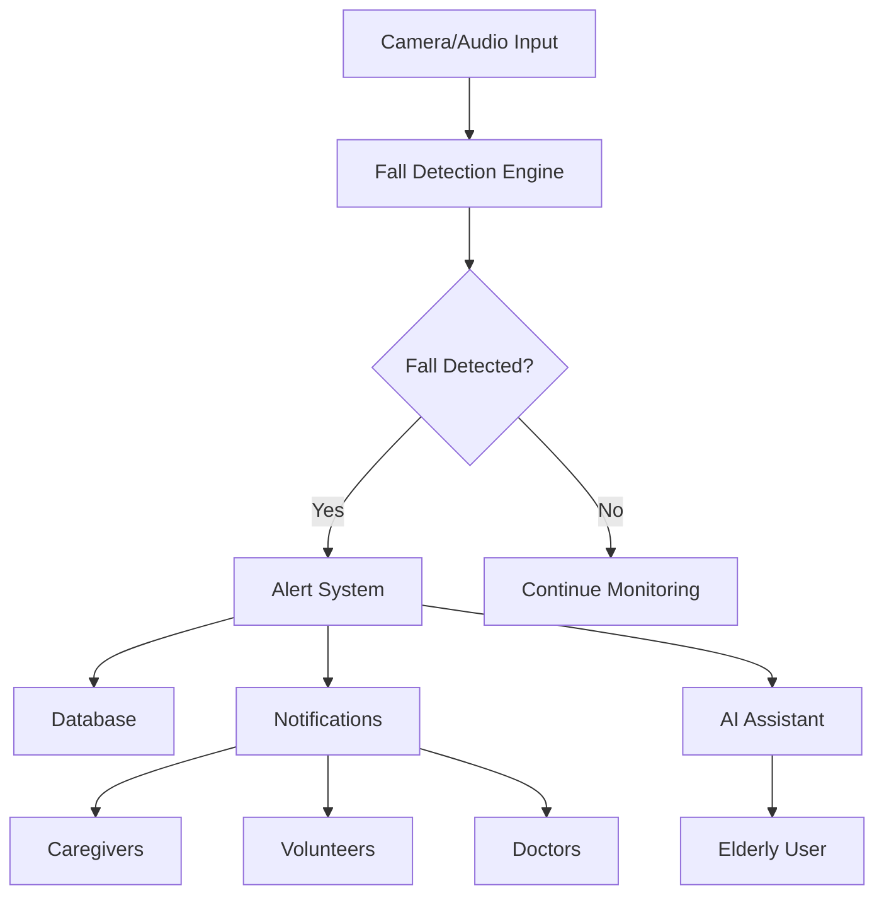

# CareConnect System Architecture

## Overview

CareConnect is built as a modular, scalable system with the following key components:

## System Components

### 1. Core Detection Engine

#### Video-Based Fall Detection
- **MediaPipe Pose**: Real-time pose estimation
- **OpenCV**: Video processing and computer vision
- **ML Classifiers**: Random Forest/MLP for fall classification
- **Features Detected**:
  - Sudden vertical → horizontal transitions
  - Loss of balance indicators
  - Unnatural limb angles

#### Audio-Based Fall Detection
- **MFCC Features**: Mel-frequency cepstral coefficients
- **ML Classifiers**: SVM/Decision Tree for sound classification
- **Sounds Detected**:
  - Impact/thud sounds
  - Distress vocalizations
  - Abnormal silence patterns

### 2. Backend Services

#### FastAPI Application
- **RESTful API**: CRUD operations for users, alerts, locations
- **WebSocket Server**: Real-time communication
- **Authentication**: JWT-based security
- **Database ORM**: SQLAlchemy with PostgreSQL

#### Database Schema
- **Users**: Elderly individuals, caregivers, volunteers, doctors
- **Locations**: GPS coordinates and addresses
- **Alerts**: Fall detections and manual triggers
- **Sessions**: User login sessions

### 3. Alert & Communication System

#### Multi-Channel Notifications
- **SMS**: Twilio integration
- **Email**: SMTP server support
- **Voice Calls**: Twilio voice API
- **WhatsApp**: Twilio WhatsApp integration
- **Push Notifications**: Firebase Cloud Messaging

#### Emergency Response
- **Volunteer Network**: Geolocation-based matching
- **Doctor Network**: Medical professional on-call system
- **Community Resources**: Hospitals, clinics, pharmacies

### 4. AI Assistance Module

#### Text-to-Speech Engine
- **pyttsx3**: Cross-platform speech synthesis
- **Guided Recovery**: Step-by-step assistance
- **Panic Reduction**: Breathing exercises
- **Emergency Protocols**: Situation-specific guidance

### 5. Frontend Applications

#### Web Dashboard
- **React Application**: Modern, responsive UI
- **Real-time Updates**: WebSocket integration
- **User Roles**: Different views for each user type
- **Status Monitoring**: System health and alerts

#### Mobile Applications
- **Cross-Platform**: iOS and Android support
- **Offline Capability**: Local processing
- **Push Notifications**: Real-time alerts
- **GPS Tracking**: Location services

## Data Flow



## Security & Privacy

### Data Protection
- **Local Processing**: Video never leaves device
- **Encryption**: AES-256 for data at rest
- **TLS**: HTTPS for all communications
- **Access Control**: Role-based permissions

### Compliance
- **GDPR**: European data protection
- **HIPAA**: Healthcare information privacy
- **SOC 2**: Security and availability standards

## Scalability

### Horizontal Scaling
- **Microservices**: Independent service scaling
- **Load Balancing**: Nginx reverse proxy
- **Database Sharding**: User data distribution
- **CDN**: Static asset delivery

### Performance Optimization
- **Caching**: Redis for frequent queries
- **Asynchronous Processing**: Background tasks
- **Database Indexing**: Optimized queries
- **Connection Pooling**: Efficient database usage

## Deployment Architecture

### Containerization
- **Docker**: Application containerization
- **Kubernetes**: Orchestration and scaling
- **Helm Charts**: Deployment templates
- **CI/CD**: Automated deployment pipeline

### Cloud Infrastructure
- **AWS/GCP/Azure**: Cloud provider options
- **Auto Scaling**: Demand-based resource allocation
- **Monitoring**: Prometheus and Grafana
- **Logging**: ELK stack integration

## API Endpoints

### User Management
```
POST   /api/users/          # Create user
GET    /api/users/{id}      # Get user
PUT    /api/users/{id}      # Update user
DELETE /api/users/{id}      # Delete user
```

### Fall Detection
```
POST   /api/fall-detection/detect-video  # Video fall detection
POST   /api/fall-detection/detect-audio  # Audio fall detection
POST   /api/fall-detection/trigger-manual-alert  # Manual alert
GET    /api/fall-detection/status/{user_id}      # Detection status
```

### Alerts
```
POST   /api/alerts/         # Create alert
GET    /api/alerts/{id}     # Get alert
GET    /api/alerts/         # List alerts
PUT    /api/alerts/{id}     # Update alert
```

### Authentication
```
POST   /api/auth/login      # User login
POST   /api/auth/register   # User registration
```

## Monitoring & Analytics

### System Metrics
- **Uptime Monitoring**: 99.9% SLA
- **Performance Metrics**: Response times
- **Error Tracking**: Sentry integration
- **User Analytics**: Feature usage

### Health Checks
- **Database Connectivity**: Connection status
- **External Services**: Twilio, Email, etc.
- **Resource Usage**: CPU, Memory, Disk
- **Alert Processing**: Queue status

This architecture ensures CareConnect is robust, scalable, and capable of saving lives through technology.